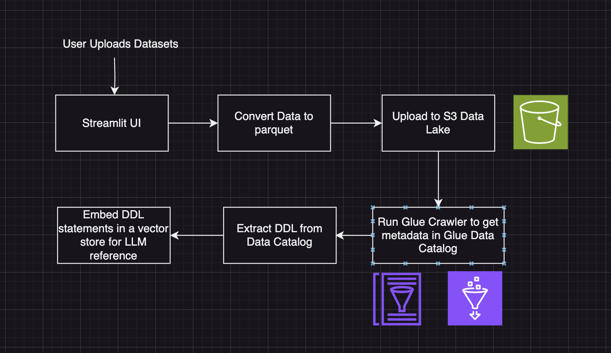
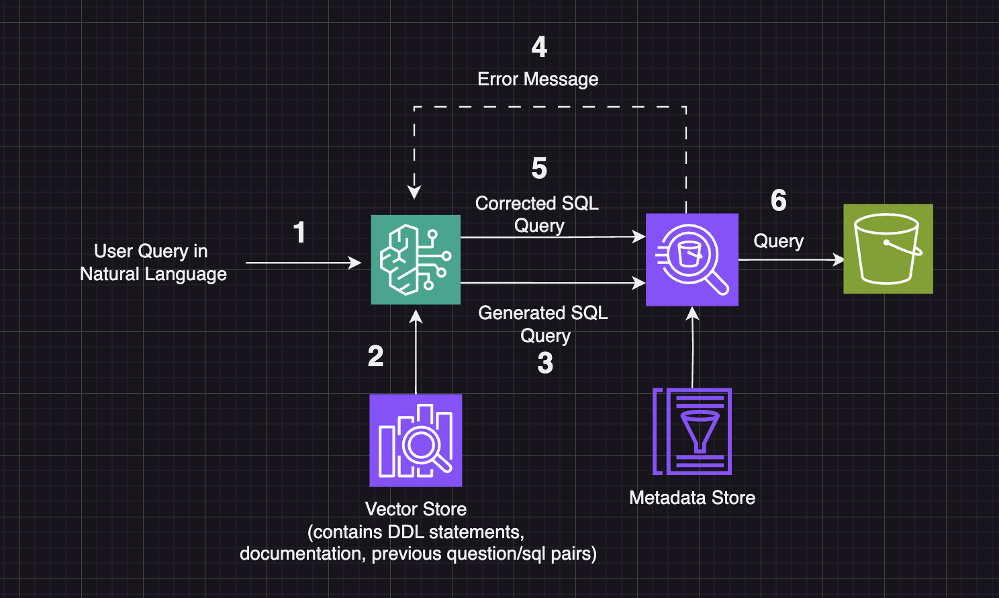

# AI Data Analysis (proof of concept)

This app leverages LLMs to convert natural language queries into AWS Athena SQL queries, query the data, generate visualizations and identify key insights from the data. The goal is to lower the barrier of entry to analyze large datasets effectively.

It is a proof of concept that is still under development.

## See It In Action

https://github.com/Denorjhan/ai-data-analysis/assets/82386687/9c964389-4baa-4de9-b822-52dc77b0d575

## Workflow diagram

This is a simplified diagram of the backend logic.

### Data Ingestion

### Data Analysis

